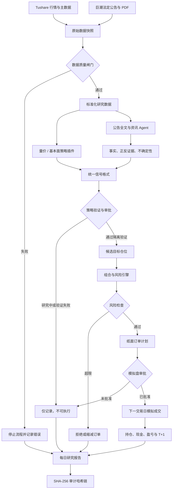
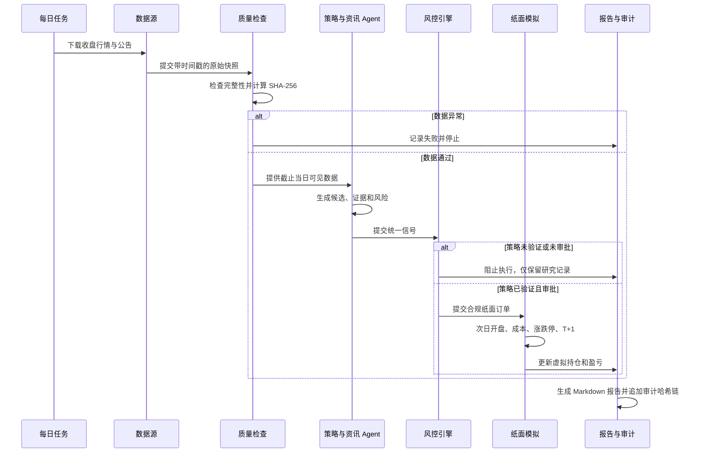

# APlan 项目架构简介

APlan 是一个面向沪深 A 股及创业板的可审计投资研究系统。它不让 Agent 直接“猜股票”，而是把数据、资讯、策略、风控、模拟成交和审计拆成独立模块。

当前系统处于 **研究模式**：基础框架已经建立，但尚无通过隔离验证的策略，因此不会生成可执行交易。



## 六个核心层

| 层级 | 作用 | 当前状态 |
|---|---|---|
| 数据层 | 行情、主数据、公告、PDF及历史快照 | 已完成基础接入 |
| 质量层 | 重复、日期、OHLC、覆盖率及文件哈希检查 | 已完成 |
| 研究层 | 可插拔策略、公告事件及资讯 Agent | 框架完成，策略研究中 |
| 决策层 | 统一信号、证据、风险和失效条件 | 已完成 |
| 风控层 | 仓位、现金、行业、换手及回撤熔断 | 已完成 |
| 执行与审计层 | 纸面成交、T+1、报告和哈希链 | 已完成，尚未启用模拟盘 |

## 每日运行流程



## 三重执行闸门

任何信号要进入纸面模拟，必须同时满足：

1. **策略闸门**：通过训练集、隔离验证集和多调仓起点检查。
2. **风险闸门**：满足仓位、现金、换手、集中度和回撤规则。
3. **审批闸门**：明确获得模拟盘审批，并将运行模式切换出 `research_only`。

实盘还需要独立审批；当前系统没有连接真实券商。

## 资讯 Agent 的定位

资讯 Agent 不是“看新闻荐股”，而是把公告转换成可验证的数据：

```text
巨潮公告
→ 保存发布时间和 PDF 原文
→ 计算文件哈希
→ 提取全文
→ 识别事实、金额、日期与风险
→ 输出正反证据和不确定性
→ 进行同类事件历史回测
→ 通过验证后才允许进入策略评分
```

目前公告分析仍不会创建可执行信号。

## 当前项目位置


- 通用框架：主体已完成。
- 策略研究：进行中，当前量价策略未通过验证。
- 纸面模拟：引擎已完成，但尚未初始化或启用。
- 实盘：未开始，也未连接券商。

