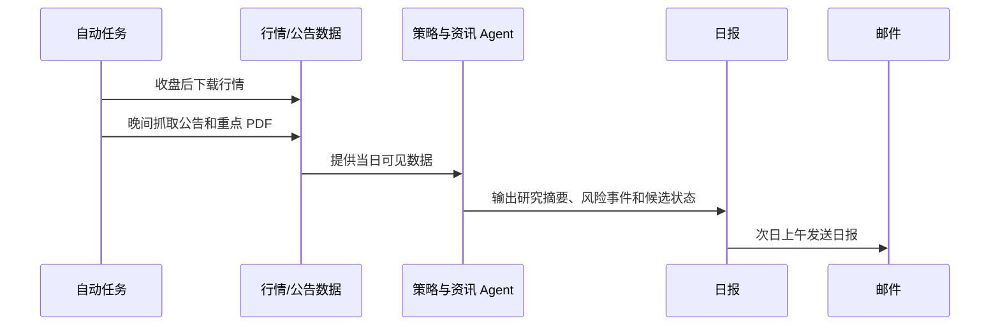

# APlan 项目介绍

> 面向 A 股和创业板的 Agent 驱动型投资研究系统。  
> 当前定位：研究系统与策略孵化平台，尚不构成投资建议，也未连接真实交易。

## 一句话介绍

APlan 是一个把行情、公告、基本面、策略模型、风控、模拟盘和审计串成闭环的 A 股智能投研系统。它的目标不是让 Agent 凭感觉“推荐股票”，而是让 Agent 在可追溯的数据、明确的策略规则、严格的风险闸门和持续回测验证中工作，逐步找到适合持有一两周、一两个月乃至半年周期的股票机会。

如果把传统量化项目看成“因子打分器”，APlan 更像一个“可审计的投资研究团队”：数据工程师负责收数，研究员负责生成假设，资讯分析员负责解读公告，风控经理负责拦截风险，组合经理负责模拟执行，审计员负责记录每一步。

## 项目背景

A 股市场有几个很鲜明的特点：

- 股票数量多，主板、创业板、科创板、北交所等市场结构复杂；
- 散户参与度高，情绪、题材和流动性变化快；
- 公告、监管、减持、业绩预告、重组、退市风险等信息对短中期股价影响很大；
- 纯技术指标容易过拟合，纯资讯判断又容易主观化；
- 很多“荐股系统”缺少审计、回测、风控和可复盘机制。

APlan 正是为了解决这些问题而建立：它尝试把量化规则的纪律性和 Agent 的信息处理能力结合起来。量化模型负责提出可验证的候选，资讯 Agent 负责补充正反证据，风控系统负责阻止冲动交易，审计链负责让每一次判断都可回溯。

## 项目目的

APlan 的长期目标是建立一套可以持续迭代的 A 股选股和组合研究框架：

1. 从全 A 股范围中筛出值得跟踪的候选股票，包含创业板 300 开头股票。
2. 针对不同持有周期做策略研究，包括 5、10、20、30、40、60、90、120 日等周期。
3. 将历史行情、每日行情、公告全文、基本面、估值、行业强弱和市场环境纳入统一证据体系。
4. 在策略通过隔离验证前，坚决不进入模拟盘或实盘。
5. 在模拟盘阶段记录真实可执行约束，例如次日开盘、滑点、佣金、印花税、涨跌停、T+1、仓位限制。
6. 最终争取形成一套“可解释、可审计、可迭代”的股票研究系统，而不是一次性的黑箱模型。

## 当前项目状态

目前 APlan 已经完成了主体工程框架，正在进入策略研究和优化阶段。


已完成：

- A 股证券主数据和历史行情接入；
- 每日行情下载、质量检查和报告生成；
- 巨潮公告抓取、公告标题分类、重点 PDF 全文提取；
- 策略插件框架、统一信号格式、证据结构；
- 风险控制模块；
- 纸面模拟交易引擎；
- 每日 Markdown 报告；
- SHA-256 审计哈希链；
- 每日自动任务和邮件推送。

仍在研究：

- 可投入模拟盘的正式策略；
- 多周期策略组合；
- 公告事件与收益之间的历史验证；
- 更强的基本面和行业因子；
- Agent 对资讯事件的结构化判断和复盘学习。

当前系统仍处于 `research_only` 模式。也就是说，它可以研究、观察、生成候选和风险提示，但不会生成可执行交易指令。

## 核心功能

### 1. 数据自动化

APlan 每日自动收集和处理：

- A 股每日行情；
- 股票主数据；
- 估值快照；
- 基本面快照；
- 巨潮公告；
- 重点公告 PDF 全文；
- 数据质量报告；
- 每日研究报告。

数据会保留原始快照和处理后文件，方便未来复盘某一天系统到底看到了什么。

### 2. 候选股票研究

系统会从全市场中筛选候选股票，重点关注：

- 趋势是否强于横截面其他股票；
- 波动是否过高；
- 成交额是否改善；
- 是否处于弱势行业；
- 当前市场环境是否适合进攻；
- 是否有高风险公告；
- 基本面是否存在明显风险；
- 估值是否需要额外谨慎。

这一步输出的不是“买入指令”，而是研究候选和正反证据。

### 3. 公告与资讯 Agent

APlan 的资讯 Agent 不是简单看新闻标题，而是做结构化处理：

```text
巨潮公告
→ 保存原始页面和 PDF
→ 记录发布时间
→ 提取标题和正文
→ 分类事件类型
→ 判断风险等级
→ 提取正面证据、负面证据和不确定性
→ 接入候选股票研究
```

当前重点识别：

- 退市风险；
- 监管处罚；
- 减持；
- 诉讼仲裁；
- 业绩预告；
- 重组并购；
- 股权激励；
- 回购；
- 重大合同；
- 风险提示。

公告层目前主要作为风险闸门使用。换句话说，高风险公告会降低或拦截候选股票，但正向公告还不会未经验证地直接加分。

### 4. 策略验证

每个策略想进入模拟盘，必须经过：

- 历史回测；
- 不同持有周期比较；
- 训练集和隔离验证集拆分；
- 多个调仓起点测试；
- 与基准指数比较；
- 交易成本、滑点、印花税、涨跌停和 T+1 等现实约束。

这套机制的核心思想是：宁可慢一点，也不要把一个偶然有效的回测结果误认为真正策略。

### 5. 风控和模拟盘

风控模块限制：

- 最大持仓数量；
- 单只股票最大仓位；
- 行业最大仓位；
- 总仓位；
- 最低现金比例；
- 每日换手；
- 最大回撤熔断；
- A 股 100 股整手。

纸面模拟引擎支持：

- 下一交易日开盘模拟成交；
- 滑点；
- 佣金；
- 印花税；
- 一字涨跌停限制；
- T+1；
- 现金和持仓更新。

当前模拟盘引擎已经具备，但因为策略尚未通过验证，所以尚未正式启用。

### 6. 审计和日报

系统每天生成研究报告，并把关键运行结果写入审计链。审计链会记录：

- 使用的数据；
- 数据质量；
- 策略状态；
- 公告数量；
- 高风险事件；
- 全文处理情况；
- 风控状态；
- 组合状态；
- 文件哈希。

这使得每一次判断都可以回到当时的数据环境中复盘。

## 当前策略模型：APlan v0.1 证据约束型相对强度策略

当前项目最值得介绍的核心，是正在孵化的策略框架。它不是一个已经优化完成的收益模型，而是 APlan 与普通选股工具最大的区别：策略不是单一公式，而是一套“候选生成 + 证据约束 + 风险闸门 + 审计复盘”的完整方法。

可以暂时称为：

> APlan v0.1 证据约束型相对强度策略  
> Evidence-Gated Relative Strength Strategy

### 策略的基本假设

这套策略的基本假设是：

1. A 股中短期机会常常来自“相对强势 + 流动性改善 + 风险没有明显恶化”的股票。
2. 单纯追涨容易踩到高波动、题材衰退、公告风险或市场弱势环境。
3. 因此，候选股票必须先有量价优势，再接受公告、基本面、行业和市场环境的约束。
4. Agent 的价值不是替代策略规则，而是把文本资讯转化为可验证证据，帮助策略避免明显风险或识别潜在催化。

### 股票池

当前策略从沪深 A 股中筛选，覆盖创业板股票。候选股票需要先通过基础过滤：

- 排除 ST 和退市风险股票；
- 排除上市时间过短的股票；
- 排除近期成交额不足的股票；
- 要有足够历史行情用于计算动量、波动和成交额趋势。

### 横截面评分

当前 v0.1 使用可解释的横截面评分。核心不是预测绝对涨跌，而是比较同一天所有可交易股票之间的相对吸引力。

基础分项包括：

| 分项 | 当前作用 | 直观含义 |
|---|---|---|
| 相对强度 | 主要正向因子 | 最近一段时间是否跑赢其他股票 |
| 趋势回撤 / 低波动 | 风险调整因子 | 强势是否过于剧烈、是否容易回撤 |
| 成交额趋势 | 流动性因子 | 是否有资金关注度改善 |
| 质量与催化 | 暂时保守占位 | 未来接入基本面质量和公告催化 |
| 估值风险 | 保守风险项 | PE/PB 过高或异常时降低信心 |
| 执行适配度 | 交易可行性 | 是否适合被纳入组合和交易执行 |

当前代码中的基础权重近似为：

- 相对强度：30；
- 低波动 / 趋势稳定：20；
- 成交额趋势：15；
- 质量与催化：5，当前不主动加分；
- 估值风险：3，当前偏保守；
- 执行适配度：7。

这套分数故意保持简单，因为当前阶段的重点不是堆复杂因子，而是验证整条研究链路是否可靠。

### 风险闸门

APlan v0.1 的真正特色在于“闸门”，也就是先把容易出问题的股票拦下来。

当前已经接入的闸门包括：

1. 公告闸门  
   如果出现重大退市、监管、诉讼、减持等高风险公告，候选分数会被压低；极高风险事件可以直接压到忽略区间。

2. 基本面风险闸门  
   如果净利润同比大幅下滑、经营现金流与利润背离、资产负债率过高，系统不会因为短期走势好就贸然升级候选。

3. 市场环境闸门  
   如果市场整体环境偏弱，例如多数股票跌破均线、横截面动量很差，系统会降低候选上限。

4. 行业强弱闸门  
   如果个股所在行业处于明显弱势，即使个股短期有反弹，也会被降低候选等级。

5. 执行闸门  
   没有通过策略验证、没有模拟盘审批、处于 `research_only` 模式时，任何信号都不能变成交易。

### 候选等级

系统不会简单输出“买/卖”，而是给出研究等级：

| 分数区间 | 决策带 | 含义 |
|---:|---|---|
| < 50 | reject_ignore | 忽略 |
| 50–65 | watch_only | 仅观察 |
| 65–75 | research_candidate | 研究候选 |
| 75–85 | paper_candidate_if_validated | 若策略验证通过，可进入模拟盘候选 |
| > 85 | high_priority_research | 高优先级研究 |

当前因为策略尚未通过隔离验证，所有候选都只能停留在研究层面。

### 入场风格分类

系统还会把候选股票粗略分成几种观察风格：

- 突破延续观察：强势动量 + 成交额改善；
- 上升趋势回调观察：价格仍有动量，但成交额没有明显放大；
- 均值回归观察：短期偏弱但成交额改善，当前未验证；
- 仅观察或未分类。

这些分类帮助研究员理解“为什么这只股票出现”，但不会单独构成买入理由。

### 失效条件

每个候选都必须有失效条件。当前默认包括：

- 相对强度跌出同周期候选组；
- 成交额趋势转弱且价格无法维持趋势；
- 出现未审阅的高风险公告或交易限制。

这是 APlan 的一个重要纪律：任何候选都不能只有看多理由，也必须写清楚什么情况下原判断失效。

## 当前策略验证结果

APlan 已经做过几轮早期验证，结论是：工程链路有效，但当前 v0.1 量价策略尚未通过严格验证。

第一轮基线回测中，40 日周期曾经显示出较好表现：

- 40 日周期年化收益约 20.15%；
- 最大回撤约 -13.92%；
- Sharpe 约 1.27。

但第二轮对 40 日周期做不同调仓起点测试后，只在 2/4 个起点取得正超额收益，说明对调仓日期敏感，稳健性不足。

之后进行多周期训练 / 验证拆分：

- 训练期：2023–2024；
- 验证期：2025–2026；
- 测试周期：5、10、20、30、60、90、120 日；
- 每个周期测试四个调仓起点。

训练期选中的 20 日周期在验证期未通过，验证期 0/4 个起点取得正超额。

这个结果很重要：它说明 APlan 没有为了“看起来好看”而把验证集上表现较好的周期倒推成策略。系统选择了拒绝当前策略，而不是过拟合。

从对外介绍角度看，这恰恰是项目可信度的一部分：APlan 的核心不是承诺某个未经验证的收益，而是建立一套能诚实淘汰坏策略、持续孵化好策略的机器。

## APlan 和普通选股项目的区别

### 1. Agent 不直接荐股

很多 AI 选股系统会让模型读新闻后直接输出股票。APlan 不这么做。

APlan 中的 Agent 主要负责：

- 读取公告；
- 提取事实；
- 标注正反证据；
- 识别不确定性；
- 补充研究理由；
- 帮助复盘。

它不能绕过策略验证和风控闸门。

### 2. 策略必须可验证

每个策略都要经过数据切分、多起点测试和交易约束测试。没有通过验证的策略，不能进入模拟盘。

### 3. 候选必须有反对证据

APlan 的信号格式要求必须包含：

- 策略 ID；
- 版本；
- 数据哈希；
- 证据；
- 风险；
- 失效条件；
- 目标周期；
- 信心；
- 是否可执行。

这可以减少“只讲故事、不讲风险”的主观判断。

### 4. 所有结果可审计

系统会保留原始数据、处理后数据、报告和审计哈希。未来复盘时，可以知道系统在某一天到底基于什么信息做出了什么判断。

### 5. 先框架，后策略

APlan 当前选择的是稳健路线：先搭好完整投研流水线，再逐步优化策略。这样即使第一个策略不成功，系统也可以继续孵化新的策略，例如：

- 更偏公告事件驱动；
- 更偏基本面质量；
- 更偏行业轮动；
- 更偏中期趋势；
- 更依赖资讯 Agent 的正反证据。

## 每日工作流

当前系统已经设置了自动任务：



当前邮件会发送到已配置邮箱，内容包括：

- 数据质量；
- 公告数量；
- 高风险事件；
- 全文处理情况；
- 策略状态；
- 组合状态；
- 附件中的完整 Markdown 报告。

## 基本用法

日常使用上，普通用户不需要每天手动操作。系统会自动运行。

如果需要手动执行，常见命令包括：

```bash
# 运行每日研究工作流
PYTHONPATH=src python3 -m aplan.daily_workflow --date 20260706

# 验证审计链
PYTHONPATH=src python3 -m aplan.audit verify

# 抓取公告
PYTHONPATH=src python3 -m aplan.announcements sync --date 20260706

# 处理重点公告全文
PYTHONPATH=src python3 -m aplan.announcement_fulltext process --date 20260706 --risk critical,high --limit 10

# 发送最新日报邮件
PYTHONPATH=src python3 -m aplan.email_notify send-latest

# 查看策略注册状态
PYTHONPATH=src python3 -m aplan.strategy_cli list
```

当前如果查看策略注册状态，会看到没有已批准策略。这是刻意设计：研究策略必须通过验证后才会显式注册。

## 为什么这个项目有投资价值

APlan 的价值不在于当前已经找到一个“稳赚策略”，而在于它已经建立了一个可以持续产生、验证和淘汰策略的基础设施。

它的潜在价值体现在：

1. 可扩展  
   新的数据源、新因子、新 Agent、新策略都可以接入统一框架。

2. 可复盘  
   每日数据、公告、报告和审计链可以长期积累，形成策略训练和复盘资产。

3. 可控风险  
   系统默认研究模式，不会因为模型输出而直接交易。

4. 适合 A 股  
   设计时考虑了 A 股特有的公告、涨跌停、T+1、100 股整手、ST、退市风险和流动性约束。

5. Agent 有明确边界  
   Agent 负责信息处理和研究辅助，交易决策仍受策略验证、风控和审批控制。

6. 策略路线灵活  
   如果量价策略长期无法通过验证，系统可以转向更重资讯 Agent 的事件驱动策略，或者结合基本面、行业轮动、资金流和公告催化。

## 下一步路线

建议后续按以下顺序推进：

1. 策略研究  
   继续做因子实验，重点寻找在训练期和验证期都稳定的收益来源。

2. 公告事件回测  
   将退市风险、减持、回购、业绩预告、重大合同、重组等事件做历史样本验证。

3. 基本面质量接入  
   把盈利质量、现金流、负债、ROE、收入增速等因子按披露时间严格对齐。

4. 多策略组合  
   不追求一个策略覆盖所有周期，而是寻找各自擅长的周期和市场环境。

5. 纸面模拟  
   只有当至少一个策略通过隔离验证后，再初始化模拟资金，连续运行 2–3 个月。

6. 小资金实盘评估  
   模拟盘稳定后，再考虑人工确认的小资金实盘，并继续保留风控和审计。

## 项目当前结论

APlan 目前不是一个已经宣称可以直接赚钱的交易系统，而是一个已经具备严肃投研基础设施的策略孵化平台。

它的核心亮点是：

- 面向 A 股真实交易约束；
- 数据、公告、策略、风控、模拟盘和审计全链路打通；
- Agent 被放在“证据处理”位置，而不是“随意荐股”位置；
- 当前策略虽然尚未通过验证，但系统已经能识别并拒绝不稳健策略；
- 后续可以沿量价、公告事件、基本面、行业轮动等方向持续迭代。

用一句话概括：

> APlan 的核心不是让 AI 今天说出一只股票，而是建立一套能长期、诚实、可复盘地寻找股票机会的系统。

